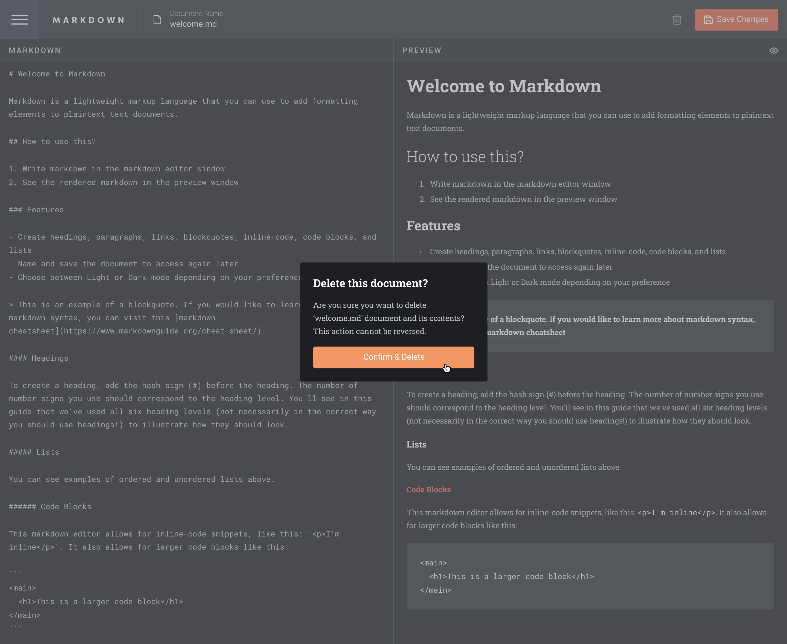
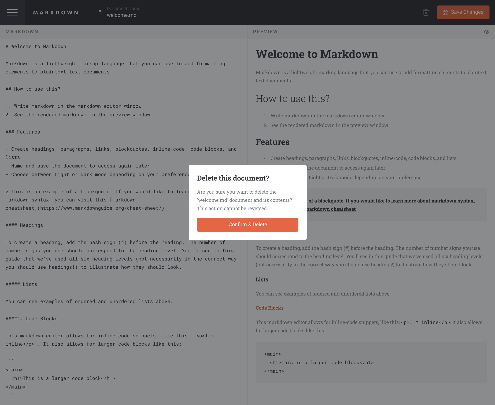
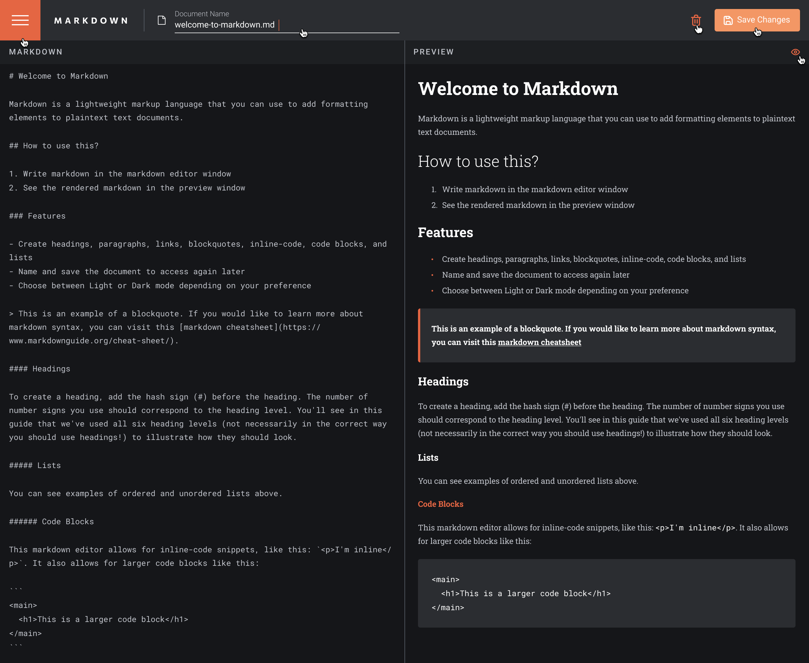
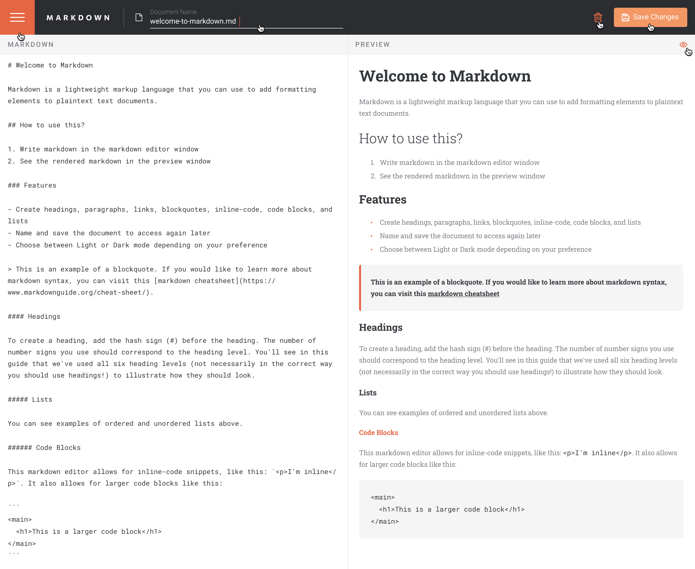
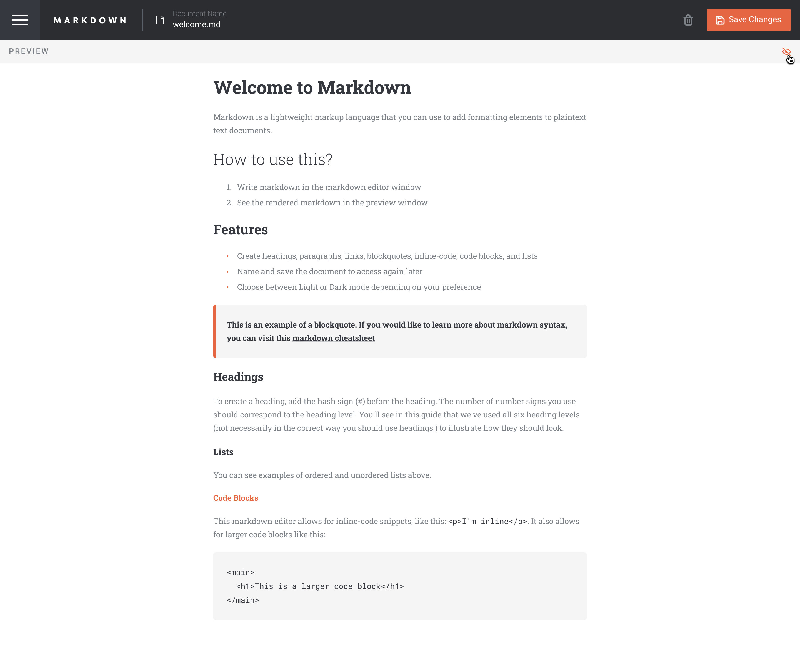

# In-browser markdown editor solution with Angular

This is a solution to the [In-browser markdown editor challenge from Amalitech Training Program](https://www.frontendmentor.io/challenges/inbrowser-markdown-editor-r16TrrQX9). 

## Table of contents

- [Overview](#overview)
  - [The challenge](#the-challenge)
  - [Screenshot](#screenshot)
  - [Links](#links)
- [My process](#my-process)
  - [Built with](#stack)
- [Author](#author)

## Overview

### The challenge

Users should be able to:

- Create, Read, Update, and Delete markdown documents
- Name and save documents to be accessed as needed
- Edit the markdown of a document and see the formatted preview of the content
- View a full-page preview of the formatted content
- View the optimal layout for the app depending on their device's screen size
- See hover states for all interactive elements on the page
- **LocalStorage**:LocalStorage is used to save the current state in the browser that persists when the browser is refreshed

### Screenshot

### Links

- Solution URL: [Solution Link](https://github.com/abdulrashid232/inbrowser_markdown)
- Live Site URL: [Add live site URL here](https://your-live-site-url.com)

## My process

### Stack

- [Angular](angular.io) -Angular 17
- [TypeScript]
- [Tailwind CSS](tailwind.docs) - For styles 
- Ngx-markdown - Angular markdown library

## Author

- Website - [Abdul-Rashid](https://www.your-site.com)

